# Transformer PyTorch TensorRT - Machine Translation Implementation


A complete PyTorch implementation of the Transformer architecture from the paper ["Attention Is All You Need"](https://arxiv.org/abs/1706.03762) for machine translation tasks. This repository provides a clean, well-documented implementation suitable for learning and research purposes, with special optimizations for NVIDIA Jetson Nano devices.

## 📋 Overview

This project implements a sequence-to-sequence Transformer model for machine translation. The implementation includes all core components of the Transformer architecture:

- **Multi-Head Attention Mechanism**: Self-attention and cross-attention layers
- **Encoder-Decoder Architecture**: Stacked encoder and decoder blocks
- **Positional Encoding**: Sinusoidal positional embeddings
- **Feed-Forward Networks**: Position-wise fully connected layers
- **Residual Connections & Layer Normalization**: For stable training

The model is trained on bilingual datasets (e.g., OPUS Books) and can be configured for various language pairs.

## ✨ Features

- **Complete Transformer Implementation**: All components from the original paper
- **Bilingual Translation Support**: Train on any language pair from HuggingFace datasets
- **Automatic Tokenization**: Word-level tokenizers with special tokens ([SOS], [EOS], [PAD], [UNK])
- **Training Pipeline**: Full training loop with validation, checkpointing, and TensorBoard logging
- **Evaluation Metrics**: Character Error Rate (CER), Word Error Rate (WER), and BLEU score
- **Jetson Nano Optimized**: Pre-built wheels and installation scripts for NVIDIA Jetson devices
- **Greedy Decoding**: Inference implementation for translation generation

## 🏗️ Architecture

The model follows the standard Transformer architecture:

- **Encoder**: 6 stacked encoder blocks, each containing:
  - Multi-head self-attention
  - Position-wise feed-forward network
  - Residual connections and layer normalization

- **Decoder**: 6 stacked decoder blocks, each containing:
  - Masked multi-head self-attention
  - Multi-head cross-attention (encoder-decoder attention)
  - Position-wise feed-forward network
  - Residual connections and layer normalization

- **Default Hyperparameters**:
  - Model dimension (d_model): 512
  - Number of attention heads (h): 8
  - Feed-forward dimension (d_ff): 2048
  - Number of layers (N): 6
  - Dropout: 0.1
  - Maximum sequence length: 512

## 📁 Project Structure

```
Transformer_PyTorch_TensorRT/
├── model.py              # Transformer architecture implementation
├── dataset.py            # BilingualDataset and data processing
├── train.py             # Training script with validation
├── config.py            # Configuration management
├── requirements.txt     # Python dependencies
├── test_version.py      # Package version checker
├── torchtext_install_0_18.sh  # TorchText build script for Jetson
├── complie_pycuda_jetson.sh  # PyCuda build script for jetson
├── export_onnx_tensorrt_split.py   # Export the ".pt" model split into encoder/decoder/projection components as ONNX and TensorRT engines
├── run_trt_split.py     # Run inference using split TensorRT engines (encoder, decoder, projection)
├── Inference.ipynb      # Jupyter notebook for inference, benchmarking, and comparing PyTorch vs TensorRT models
├── jetson_wheel/        # Pre-built torchtext wheel for Jetson
└── docs/                # Sphinx documentation source files
```

## 🔧 Requirements

### For Jetson Nano Super
* **Jetpack**: 6.2 (Confirm: `apt show nvidia-jetpack`)
* **CUDA**: 12.6 (Confirm: `nvcc --version`)
* **Python**: 3.10 (Confirm: `python --version`)

### Dependencies
- PyTorch 2.8.0 (with CUDA support)
- torchvision 0.23.0
- torchaudio 2.8.0
- HuggingFace datasets 2.14.6
- tokenizers
- torchtext 0.18.0
- torchmetrics
- tensorboard
- numpy 1.21.5
- pandas 1.3.5

#### Optional Dependencies
- onnx
- onnxruntime
- pycuda
- tensorrt
- jupyter (for Inference.ipynb)

## 🚀 Installation

### For Jetson Nano

1. **Create a virtual environment**:
   ```bash
   python -m venv myenv_jetson
   source myenv_jetson/bin/activate
   ```

2. **Install dependencies**:
   ```bash
   pip install --index-url https://pypi.jetson-ai-lab.io/jp6/cu126 -r requirements.txt
   ```

3. **TorchText Installation**:
   - A pre-built wheel is provided in `jetson_wheel/` directory
   - If you prefer to build from source, use the provided script:
     ```bash
     bash torchtext_install_0_18.sh
     ```
4. **PyCuda Installation**:
   - A pre-built wheel is provided in `jetson_wheel/` directory
   - If you prefer to build from source, use the provided script:
     ```bash
     bash compile_pycuda_jetson.sh
     ```

### For Other Platforms

Install dependencies using standard pip:
```bash
pip install -r requirements.txt
```

Note: You may need to adjust PyTorch installation commands based on your CUDA version and platform.

## 📖 Usage

### Training

1. **Configure the model** in `config.py`:
   - Set source and target languages (`lang_src`, `lang_tgt`)
   - Adjust hyperparameters (batch size, learning rate, epochs, etc.)
   - Specify dataset source (`datasource`)

2. **Run training**:
   ```bash
   python train.py
   ```

3. **Monitor training**:
   - TensorBoard logs are saved to `runs/tmodel/`
   - View with: `tensorboard --logdir runs/tmodel`
   - Model checkpoints are saved in the `weights/` directory

### Configuration Options

Key configuration parameters in `config.py`:
- `batch_size`: Training batch size (default: 8)
- `num_epochs`: Number of training epochs (default: 20)
- `lr`: Learning rate (default: 1e-4)
- `seq_len`: Maximum sequence length (default: 512)
- `d_model`: Model dimension (default: 512)
- `lang_src`: Source language code (default: "en")
- `lang_tgt`: Target language code (default: "de")
- `preload`: Path to checkpoint for resuming training (default: None)

### Resuming Training

To resume from a checkpoint, set `preload` in the config:
```python
config['preload'] = "10"  # Resume from epoch 10
```

## 📊 Evaluation

The training script automatically runs validation after each epoch, computing:
- **Character Error Rate (CER)**
- **Word Error Rate (WER)**
- **BLEU Score**

Validation examples are printed to the console and logged to TensorBoard.

## 🧪 Testing

Check installed package versions:
```bash
python test_version.py
```

## 🚀 TensorRT Export and Inference (Split Model)

The repository includes scripts to export the trained model to ONNX and TensorRT formats, split into separate components for optimized inference.

### Exporting to ONNX and TensorRT (Split)

The `export_onnx_tensorrt_split.py` script exports the trained PyTorch model by splitting it into three components:
- **Encoder**: Processes source sequences
- **Decoder**: Generates target sequences using encoder output
- **Projection**: Maps decoder output to vocabulary logits

This split approach allows for:
- Better memory management on resource-constrained devices
- Incremental decoding (generating tokens one at a time)
- More flexible inference pipeline

To export your trained model:

```bash
python export_onnx_tensorrt_split.py
```

The script will:
1. Load the latest checkpoint from `weights/` directory
2. Export each component (encoder, decoder, projection) to ONNX format in `onnx_split/`
3. Build TensorRT engines for each component in `tensorrt_split/`
4. Support dynamic shapes for variable sequence lengths

**Requirements**: 
- TensorRT installed and `trtexec` available in PATH or at `/usr/src/tensorrt/bin/trtexec`
- ONNX and TensorRT Python packages

### Running Inference with TensorRT (Split)

The `run_trt_split.py` script loads the split TensorRT engines and runs inference on the validation dataset:

```bash
python run_trt_split.py
```

The script:
- Loads the three TensorRT engines (encoder, decoder, projection)
- Runs greedy decoding for translation
- Validates on the test dataset and prints translation examples
- Uses TensorRT 10.3+ API with `execute_async_v3` for optimal performance

**Note**: Make sure the engine files exist in `tensorrt_split/` directory before running inference. The default paths are:
- `tensorrt_split/tmodel_10_encoder.engine`
- `tensorrt_split/tmodel_10_decoder.engine`
- `tensorrt_split/tmodel_10_projection.engine`

You can modify these paths in the script if needed.

### Inference and Benchmarking with Jupyter Notebook

The `Inference.ipynb` notebook provides an interactive environment for:
- **Running inference** with both PyTorch and TensorRT models
- **Benchmarking performance** comparing latency between PyTorch and TensorRT
- **Verifying correctness** by comparing outputs from both models
- **Analyzing differences** in encoder outputs and logits

#### Features

1. **Model Loading**:
   - Loads trained PyTorch model from checkpoints
   - Loads split TensorRT engines (encoder, decoder, projection)

2. **Performance Benchmarking**:
   - Measures inference latency for both models
   - Computes statistics: mean, p50, p90, p99 percentiles
   - Calculates speedup factor (PyTorch / TensorRT)
   - Saves results to `benchmark_times.csv`

3. **Output Comparison**:
   - Side-by-side comparison of translations from both models
   - Verifies numerical accuracy of encoder outputs
   - Compares first-step logits between models
   - Analyzes differences in padded vs unpadded positions

4. **Validation**:
   - Runs validation on test dataset
   - Displays translation examples with source, target, and predictions

#### Usage

1. **Open the notebook**:
   ```bash
   jupyter notebook Inference.ipynb
   ```

2. **Run all cells** to:
   - Load both models
   - Run benchmarks
   - Compare outputs
   - Generate performance statistics

3. **View results**:
   - Benchmark statistics are printed in the notebook
   - Detailed comparison outputs show translation quality
   - CSV file with timing data is saved for further analysis

4. **TensorBoard Integration**:
   - The notebook includes instructions for viewing TensorBoard logs
   - Use SSH port forwarding: `ssh -L 6005:localhost:6005 user@jetson_ip`
   - Access TensorBoard at `http://localhost:6005`

#### Expected Outputs

- **Latency metrics**: Mean, median (p50), p90, and p99 percentiles in milliseconds
- **Speedup factor**: Typically 1.2x - 1.5x on Jetson devices
- **Numerical accuracy**: Encoder output differences typically < 0.001
- **Translation quality**: Both models should produce similar translations

### Multi-GPU Performance Comparison

The PyTorch Transformer model has been benchmarked across multiple GPU platforms. Below is a comparison table showing runtime performance and GPU specifications for each platform:

| GPU        | Runtime Screenshot | GPU Details Screenshot | PyTorch / TensorRT Speedup |
|------------|------------------|----------------------|----------------------|
| **MI300X** | 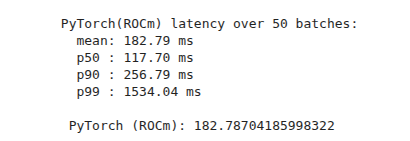 | 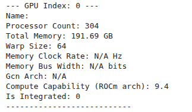 |  |
| **Tesla T4**     | 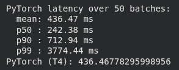 | 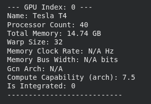 | 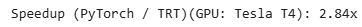 |
| **L4**     |  | 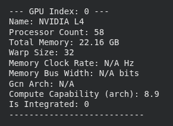 | 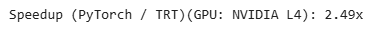 |
| **A100**   | 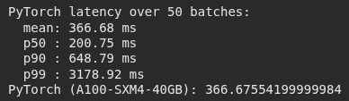 | 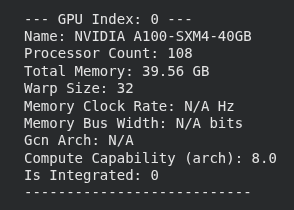 | 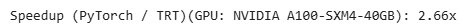 |
| **Jetson Orin Nano Super**   |  | 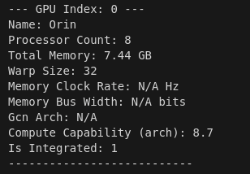 | 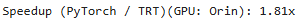 |


## 📚 Documentation

The project includes comprehensive Sphinx documentation. To generate the HTML documentation:

1. **Install Sphinx** (if not already installed):
   ```bash
   pip install sphinx
   ```

2. **Generate documentation**:
   ```bash
   cd docs/
   make html
   ```

3. **View the documentation**:
   The generated HTML documentation will be available in `docs/_build/html/`. Open `docs/_build/html/index.html` in your browser to view it. Otherwise, from the root user can also run (only in linux)
    ```bash
    xdg-open docs/_build/html/index.html
   ```


The documentation includes:
- API reference for all modules (`model`, `dataset`, `config`, `train`)
- Detailed class and function documentation
- Code examples and usage patterns

## 📝 Notes

- The implementation uses greedy decoding for inference
- Tokenizers are automatically built from the dataset if not found
- The dataset is split 90% training / 10% validation
- Model weights are saved after each epoch
- Training uses label smoothing (0.1) and ignores padding tokens in loss calculation

---

**Note**: This implementation was written while following the https://www.youtube.com/watch?v=ISNdQcPhsts&t=9840s video by Umar Jamil. All credits goes to him, the novelity of this repository is that the transformer was trained on Jetson Nano Super, therefore, the dependencies versions might vary and also there are subtle difference in LayerNormalization, etc. The repository contains conversion of the exported ".pt" model to ONNX and also TensorRT and also provides benchmarking of inferencing with PyTorch vs TensorRT. Moreover, the repository is very verbose containing comments and documentation. 
